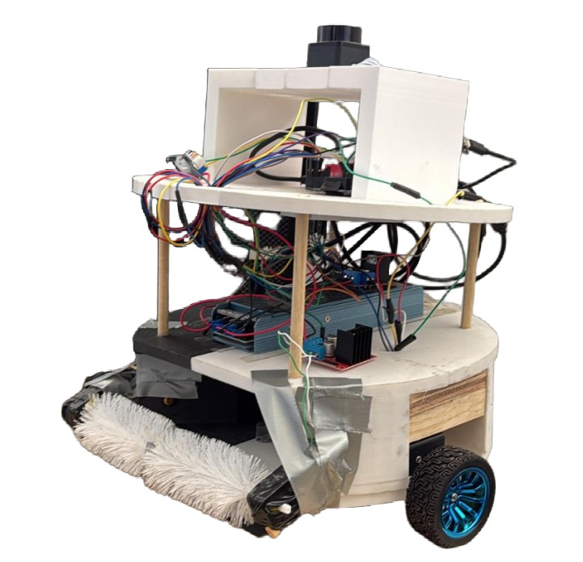
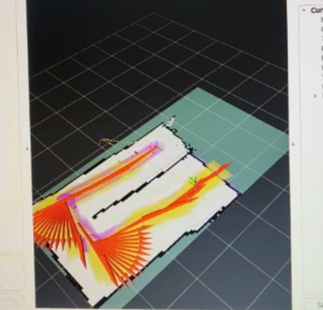
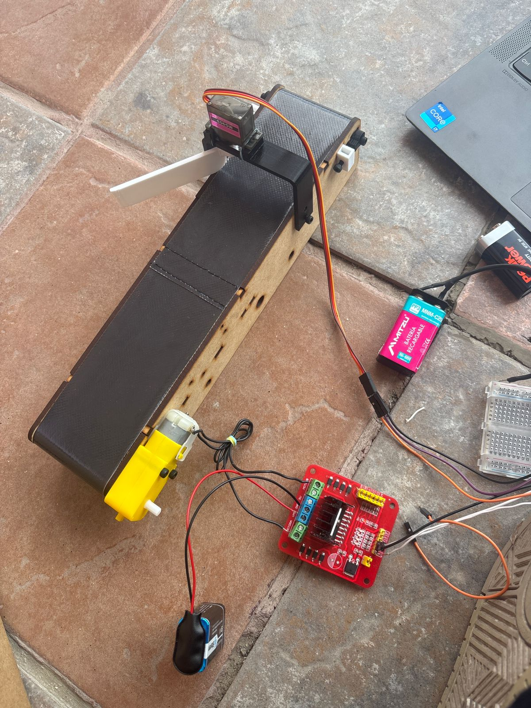
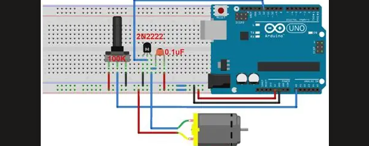

<div align="center">

#  Autonomous Waste Collection and Classification System

### ROS 2 • YOLOv8 • OpenCV • LiDAR • Nav2 • Arduino • Raspberry Pi



</div>

---

# Descripción General

Este proyecto integra:

- Robótica móvil autónoma
- Inteligencia artificial
- Visión artificial
- Automatización industrial
- Navegación utilizando ROS 2
- Detección de objetos con YOLOv8

El sistema está dividido en dos subsistemas principales:

1. Robot autónomo de recolección de residuos
2. Sistema inteligente de clasificación mediante banda transportadora

---

# Características Principales

 Navegación autónoma utilizando ROS 2 Nav2  
 Mapeo SLAM utilizando LiDAR LD06  
 Robot con tracción diferencial  
 Clasificación de residuos en tiempo real  
 Red neuronal YOLOv8  
 Automatización de banda transportadora  
 Comunicación serial con Arduino  
 Detección de objetos en tiempo real  
 Clasificación de residuos orgánicos e inorgánicos  

---

# Tutorial: Sistema de Recolección y Separación de basura
El funcionamiento se divide en dos partes:
La primera parte se basa  en un robot móvil autónomo diseñado para apoyar la recolección de residuos sólidos en espacios controlados. El robot inicia con el encendido del sistema y la inicialización de la Raspberry Pi, Arduino y ROS 2. Posteriormente, el robot comienza la lectura de sensores, principalmente el LiDAR, para detectar obstáculos y comprender su entorno.
Una vez iniciado el sistema, el robot navega de manera autónoma siguiendo una ruta o puntos de referencia. Si detecta un obstáculo, evita la colisión y recalcula su trayectoria. Si detecta un residuo, se posiciona frente a él, activa el mecanismo de recolección y almacena el objeto dentro de su compartimiento interno.Luego, en la segunda parte consiste en clasificar y separar los residuos recolectados. Para ello, se utiliza una banda transportadora que, a través de visión y una red neuronal, puede clasificar residuos orgánicos e inorgánicos

# Índice

1. [Introducción General](#introducción-general)

2. [Objetivo del Proyecto](#objetivo-del-proyecto)

3. [Funcionamiento General del Sistema](#funcionamiento-general-del-sistema)

4. [Arquitectura General del Sistema](#arquitectura-general-del-sistema)

5. [Robot Recolector Autónomo](#robot-recolector-autónomo)

   - [Hardware Necesario](#hardware-necesario)
   - [Software Necesario](#software-necesario)
   - [Arquitectura del Sistema](#arquitectura-del-sistema)
   - [Instalación Necesaria](#instalación-necesaria)
   - [Configuración ROS 2](#configuración-ros-2)
   - [Instalación de Paquetes](#instalación-de-paquetes)
   - [Configuración del LiDAR](#configuración-del-lidar)
   - [Creación del Workspace](#creación-del-workspace)
   - [Configuración del Paquete del Robot](#configuración-del-paquete-del-robot)
   - [Compilación del Proyecto](#compilación-del-proyecto)
   - [Diagrama de Conexiones Eléctricas](#diagrama-de-conexiones-eléctricas)
   - [Teleoperación](#teleoperación)
   - [SLAM y Construcción del Mapa](#slam-y-construcción-del-mapa)
   - [Navegación Autónoma](#navegación-autónoma)
   - [Waypoints](#waypoints)
   - [Solución de Problemas](#solución-de-problemas)

6. [Sistema Inteligente de Banda Transportadora](#sistema-inteligente-de-banda-transportadora)

   - [Introducción](#introducción)
   - [Objetivo del Sistema](#objetivo-del-sistema)
   - [Funcionamiento General](#funcionamiento-general)
   - [Materiales Necesarios](#materiales-necesarios)
   - [Instalación del Entorno Python](#instalación-del-entorno-python)
   - [Configuración de Cámara USB](#configuración-de-cámara-usb)

7. [Entrenamiento del Modelo YOLOv8](#entrenamiento-del-modelo-yolov8)

   - [Introducción a Roboflow](#introducción-a-roboflow)
   - [Creación del Proyecto](#creación-del-proyecto)
   - [Captura del Dataset](#captura-del-dataset)
   - [Etiquetado de Imágenes](#etiquetado-de-imágenes)
   - [Data Augmentation](#data-augmentation)
   - [Entrenamiento del Modelo](#entrenamiento-del-modelo)
   - [Exportación del Modelo](#exportación-del-modelo)

8. [Automatización y Electrónica](#automatización-y-electrónica)

   - [Conexiones Arduino](#conexiones-arduino)
   - [Conexiones del Servomotor](#conexiones-del-servomotor)
   - [Conexiones L298N](#conexiones-l298n)
   - [Control PWM](#control-pwm)
   - [Flujo General del Sistema](#flujo-general-del-sistema)

9. [Código Fuente](#código-fuente)

   - [Código Python YOLOv8](#código-python-yolov8)
   - [Código Arduino](#código-arduino)

10. [Ejecución del Sistema](#ejecución-del-sistema)

11. [Problemas Comunes](#problemas-comunes)

12. [Mejoras Futuras](#mejoras-futuras)

13. [Aplicaciones Educativas](#aplicaciones-educativas)

14. [Conclusiones](#conclusiones)

15. [Referencias y Recursos Adicionales](#referencias-y-recursos-adicionales)

16. [Contacto](#contacto)
    

# 📋 Requisitos previos 
Antes de ejecutar el proyecto, se recomienda contar con los siguientes elementos:
- **Hardware necesario**:
  - Raspberry Pi 5
  - Arduino Mega
  - Sensor LiDAR
  - Motores DC veloreductores con encoders (se emplearon unos motores de 76 rpms con encoders __)
  - Fuente de alimentación de 12V-20A
  - Chasis del robot (se ve en la carpetas CAT Parts)
  - Mecanismo de recolección de residuos (se empleó un cepillo controlado por un motor de corriente directa)
  - 2 Puentes H
  - Buck converter 12V-5V
    
- **Software necesario:**
  - Ubuntu 24.04 LTS Desktop
  - ROS 2 Jazzy
  - Python
  - Arduino IDE
  - Librerías de Desarrollo para ROS 2:
    - Drivers del LiDAR (ldlidar_stl_ros2 - driver del LiDAR LD06, se clona desde GitHub)
    -  RViz 2 (Visualización del robot, del mapa, trayectorias y objetivos de navegación)
    -  Nav2 (Paquete para navegación autónoma)
    -  Slam_toolbox (Utilizado para grabar el mapa)

# 📓  Introducción 
Este es un proyecto de robótica móvil enfocado en el desarrollo de un robot autónomo para la recolección de residuos sólidos en espacios controlados, como pasillos, laboratorios, campus universitarios o áreas públicas semi-estructuradas. La idea principal del proyecto es proponer una alternativa tecnológica que apoye las tareas de limpieza, reduciendo actividades manuales repetitivas y mejorando la eficiencia en la recolección de basura.
El sistema está diseñado sobre una plataforma móvil con tracción diferencial, lo que permite controlar el movimiento del robot mediante dos ruedas motorizadas. Para su funcionamiento, se utiliza una Raspberry Pi 5 como unidad principal de procesamiento, encargada de ejecutar el sistema operativo, ROS 2 Jazzy y los nodos principales del robot. Además, se utiliza un Arduino para apoyar el control de actuadores, motores o mecanismos relacionados con la recolección de residuos.
La navegación autónoma del robot se implementa mediante ROS 2 Jazzy y Nav2, herramientas que permiten al robot desplazarse dentro de un entorno, seguir rutas o waypoints, interpretar información de sensores y generar comandos de movimiento. El robot también integra un sensor LiDAR, utilizado para detectar obstáculos y obtener información del entorno, lo que permite mejorar la seguridad durante el recorrido y evitar colisiones.
En cuanto a su funcionamiento general, este consiste en iniciar el sistema, leer la información de los sensores, navegar de forma autónoma por una ruta definida, detectar obstáculos, posicionarse frente a los residuos y activar un mecanismo de recolección para almacenarlos dentro de un compartimiento interno. 
Además, el proyecto contempla la integración de visión artificial para identificar y clasificar residuos en categorías como orgánicos e inorgánicos gracias al uso de una cámara y una banda transportadora.

# 🧩 Arquitectura del sistema
El robot está dividido en dos capas de control que se comunican entre sí:
Capa alta (Raspberry Pi 5)

-Ejecuta Ubuntu 24.04 LTS Desktop y ROS 2 Jazzy
-Procesa los datos del LiDAR
-Ejecuta el algoritmo de SLAM (slam_toolbox)
-Ejecuta la navegación autónoma (Nav2)
-Visualiza el estado del sistema en RViz2
-Envía comandos de velocidad al Arduino vía USB serial

Capa baja (Arduino Mega)

-Recibe comandos de velocidad lineal y angular
-Convierte estos comandos a señales PWM para cada motor
-Controla la dirección de los motores a través de los puentes H L298N
-Lee los encoders por interrupción (en cuadratura)
-Calcula la odometría del robot en tiempo real
-Envía la odometría de regreso a la Raspberry Pi

# 💾 Instalación necesaria:
Para instalar ROS 2 Jazzy correctamente, lo más importante es elegir bien el sistema operativo y no quedarse corto de RAM/almacenamiento, sobre todo si vas a usar Nav2, RViz, LiDAR y compilación con colcon.

- Sistema Operativo: Ubuntu 24.04 LTS Desktop
- RAM: 8GB mínimo
- Almacenamiento: 32 GB o superior
- Procesador: Raspberry Pi 5
- Puertos USB: Para conexión de LiDAR y Arduino

## Paso 1: Instalación de Ubuntu 24.04 Desktop

Instala Ubuntu 24.04 Desktop en la Raspberry Pi 5.

Verifica la versión de Python:

```bash
python3 --version
```

## Paso 2: Actualizar el sistema

```bash
sudo apt update
sudo apt upgrade
```

Instala VS Code desde el centro de aplicaciones de Ubuntu.

Reinicia el sistema.

## Paso 3: Instalar herramientas útiles para desarrollo

```bash
# Terminator (terminal con múltiples paneles)
sudo apt install -y terminator

# Tree (para visualizar estructura de carpetas)
sudo apt install -y tree
tree --version

# Python helpers
sudo apt install python-is-python3
sudo apt install python3-pip

# Monitoreo del sistema
sudo apt install -y htop

# Búsqueda rápida en archivos
sudo apt install -y ripgrep
```

## Paso 4: Instalación de ROS 2 Jazzy

Ejecuta el siguiente comando completo (es un solo comando largo con múltiples pasos encadenados con &&):

```bash
sudo apt update && sudo apt install -y software-properties-common curl && sudo add-apt-repository universe -y && sudo curl -sSL https://raw.githubusercontent.com/ros/rosdistro/master/ros.key -o /usr/share/keyrings/ros-archive-keyring.gpg && echo "deb [arch=$(dpkg --print-architecture) signed-by=/usr/share/keyrings/ros-archive-keyring.gpg] http://packages.ros.org/ros2/ubuntu $(. /etc/os-release && echo $UBUNTU_CODENAME) main" | sudo tee /etc/apt/sources.list.d/ros2.list > /dev/null && sudo apt update && sudo apt install -y ros-jazzy-desktop
```

## Paso 5: Configurar ROS 2 al iniciar la terminal

```bash
source /opt/ros/jazzy/setup.bash
echo "source /opt/ros/jazzy/setup.bash" >> ~/.bashrc
source ~/.bashrc
```

## Paso 6: Permisos del puerto serial para el Arduino

```bash
# Agregar el usuario al grupo dialout (necesario para acceder al Arduino por USB)
sudo usermod -aG dialout $USER

# Quitar brltty que bloquea el puerto USB del Arduino
sudo apt remove -y brltty

# Aplicar cambios de grupo
newgrp dialout
```

## Paso 7: Instalación de paquetes específicos del robot

```bash
# Nav2 (navegación autónoma)
sudo apt install -y ros-jazzy-navigation2 ros-jazzy-nav2-bringup

# SLAM (construcción de mapas)
sudo apt install -y ros-jazzy-slam-toolbox

# Servidor de mapas
sudo apt install -y ros-jazzy-nav2-map-server

# Comunicación serial Python
sudo apt install -y python3-serial

# Arduino IDE
sudo apt install -y arduino

# Herramientas de desarrollo ROS 2
sudo apt install -y python3-colcon-common-extensions python3-rosdep python3-argcomplete

# Inicializar rosdep
sudo rosdep init
rosdep update
```

## Paso 8: Crear el workspace ROS 2 y clonar el driver del LiDAR

```bash
# Crear estructura del workspace
mkdir -p ~/ros2_ws/src
cd ~/ros2_ws/src

# Clonar el driver del LiDAR LD06
git clone https://github.com/ldrobotSensorTeam/ldlidar_stl_ros2.git

# Compilar
cd ~/ros2_ws
colcon build --packages-select ldlidar_stl_ros2
source install/setup.bash

# Cargar el workspace automáticamente
echo "source ~/ros2_ws/install/setup.bash" >> ~/.bashrc
source ~/.bashrc
```

## Paso 9: Estructura del paquete del robot

Crea el paquete y la estructura de carpetas:

```bash
cd ~/ros2_ws/src
ros2 pkg create --build-type ament_python robot_recolector
cd robot_recolector
mkdir -p config launch
```

La estructura final del paquete debe quedar así:

```
robot_recolector/
├── config/
│   ├── mapper_params_online_async.yaml
│   ├── nav2_params.yaml
│   ├── slam.rviz
│   └── nav2.rviz
├── launch/
│   ├── slam_launch.py
│   └── nav2_launch.py
├── robot_recolector/
│   ├── __init__.py
│   ├── cmdvel_serial.py
│   └── teleop_keyboard.py
├── package.xml
├── setup.cfg
└── setup.py
```

Los archivos completos están disponibles en este repositorio. Cópialos a las carpetas correspondientes.

## Paso 10: Compilar el paquete del robot

```bash
cd ~/ros2_ws
colcon build --packages-select robot_recolector
source install/setup.bash
```

## Paso 11: Subir el firmware al Arduino

1. Abre el Arduino IDE
2. Conecta el Arduino Mega por USB a la Raspberry
3. En Herramientas → Placa, selecciona Arduino Mega 2560
4. En Herramientas → Puerto, selecciona /dev/ttyACM0
5. Abre el archivo robot_arduino.ino del repositorio
6. Click en Subir (botón con flecha →)
7. Espera a que diga "Subida completa"

⚠️ Importante: Cierra el Serial Monitor del IDE de Arduino antes de correr los nodos ROS 2, ya que ocupa el puerto USB y bloquea la comunicación.

# 🛠️ Instrucciones 

## 🔌 Diagrama de conexiones eléctricas

### Conexiones del Arduino Mega a los puentes H L298N

| Componente L298N | Pin Arduino Mega | Notas |
|---|---|---|
| **L298N #1 (motores de tracción)** | | |
| ENA (Enable motor A) | 6 (PWM) | Velocidad motor derecho |
| IN1 | 24 | Dirección motor derecho |
| IN2 | 25 | Dirección motor derecho |
| ENB (Enable motor B) | 5 (PWM) | Velocidad motor izquierdo |
| IN3 | 22 | Dirección motor izquierdo |
| IN4 | 23 | Dirección motor izquierdo |
| **L298N #2 (rodillo recolector)** | | |
| ENA | 9 (PWM) | Velocidad rodillo |
| IN1 | 26 | Dirección rodillo |
| IN2 | 27 | Dirección rodillo |

### Conexiones de los encoders al Arduino

| Encoder | Pin Arduino Mega | Notas |
|---|---|---|
| Encoder izquierdo - Canal A | 2 | **Pin de interrupción** |
| Encoder izquierdo - Canal B | 4 | Lectura digital |
| Encoder derecho - Canal A | 3 | **Pin de interrupción** |
| Encoder derecho - Canal B | 7 | Lectura digital |
| VCC encoders | 5V (Arduino) | |
| GND encoders | GND (Arduino) | |

⚠️ Importante: los canales A de los encoders deben conectarse a pines de interrupción del Arduino Mega (pines 2, 3, 18, 19, 20 o 21). El Arduino Uno solo tiene 2 y 3.

### Alimentación

| Conexión | Voltaje | Notas |
|---|---|---|
| Fuente 12V → Entrada L298N #1 (VCC motores) | 12V | Alimentación motores tracción |
| Fuente 12V → Entrada L298N #2 (VCC motor) | 12V | Alimentación motor rodillo |
| Fuente 12V → Buck converter | 12V→5V | Para Raspberry Pi |
| Buck 5V → Raspberry Pi (USB-C o pines GPIO) | 5V, mínimo 3A | |
| Raspberry Pi USB → Arduino Mega | 5V vía USB | Alimenta y comunica al Arduino |
| GND común | — | **Todos los GND deben estar conectados entre sí** |

### Comunicación Raspberry Pi ↔ Arduino

-Cable USB tipo B desde la Raspberry Pi al Arduino Mega.
-El Arduino se reconoce como /dev/ttyACM0 o /dev/ttyACM1 en Ubuntu.
-Velocidad de comunicación: 115200 baud.

### Conexión del LiDAR LD06

-Conectar al puerto USB de la Raspberry Pi mediante el adaptador USB-Serial que viene incluido.
-El LiDAR se reconoce como /dev/ttyUSB0.

## 🎮 Modo de uso

El robot tiene tres modos principales de operación:

1. Teleoperación — controlar el robot con el teclado para pruebas iniciales
2. SLAM — construir el mapa del entorno por primera vez
3. Navegación autónoma — usar un mapa ya guardado para que el robot vaya solo a un destino

Cada modo requiere terminales separadas, todas con el workspace cargado (esto pasa automáticamente si lo agregaste al .bashrc).

### Modo 1: Teleoperación

Sirve para probar que los motores responden correctamente y para calibrar la odometría.

Terminal 1 — Bridge serial (Arduino ↔ ROS2):
```bash
ros2 run robot_recolector cmdvel_serial
```

Espera a ver el mensaje "Puerto /dev/ttyACM0 abierto".

Terminal 2 — Teleop por teclado:
```bash
ros2 run robot_recolector teleop_keyboard
```

Teclas disponibles:

| Tecla | Acción |
|---|---|
| w | Avanzar |
| x | Retroceder |
| a | Girar izquierda |
| d | Girar derecha |
| s | Parada de emergencia |
| Ctrl + C | Salir |

El robot se mueve solo mientras presionas la tecla. Al soltar, se detiene.

### Modo 2: SLAM (construcción del mapa)

Este modo se usa una sola vez para mapear el espacio donde trabajará el robot.

Terminal 1 — Bridge serial:
```bash
ros2 run robot_recolector cmdvel_serial
```

Terminal 2 — Driver del LiDAR:
```bash
ros2 launch ldlidar_stl_ros2 ld06.launch.py
```

Terminal 3 — SLAM + RViz:
```bash
ros2 launch robot_recolector slam_launch.py
```

Terminal 4 — Teleop para mover el robot mientras se mapea:
```bash
ros2 run robot_recolector teleop_keyboard
```

Mueve el robot lentamente por todo el espacio que quieras mapear. Procura:
- Avanzar de forma suave, sin giros bruscos
- Pasar por las paredes y esquinas varias veces
- Cerrar el recorrido regresando al punto inicial (esto ayuda al "loop closure")

En RViz verás cómo se construye el mapa en tiempo real:
- Áreas blancas = zonas libres
- Áreas negras = obstáculos detectados
- Áreas grises = zonas desconocidas

### Modo 3: Guardar el mapa

Cuando el mapa esté completo y el robot esté detenido, en una terminal nueva:

```bash
mkdir -p ~/ros2_ws/maps
cd ~/ros2_ws/maps
ros2 run nav2_map_server map_saver_cli -f mi_mapa
```

Esto genera dos archivos en ~/ros2_ws/maps/:
- mi_mapa.pgm (imagen del mapa)
- mi_mapa.yaml (metadatos del mapa)

💡 Cambia "mi_mapa" por el nombre que prefieras. Recuerda actualizar nav2_params.yaml para apuntar a este archivo.

<div align="center">



</div>

### Modo 4: Navegación autónoma con Nav2

Una vez que tengas un mapa guardado, puedes usar Nav2 para que el robot navegue solo.

Terminal 1 — Bridge serial:
```bash
ros2 run robot_recolector cmdvel_serial
```

Terminal 2 — Driver del LiDAR:
```bash
ros2 launch ldlidar_stl_ros2 ld06.launch.py
```

Terminal 3 — Nav2 + RViz:
```bash
ros2 launch robot_recolector nav2_launch.py
```

Espera unos 15 segundos a que todos los nodos arranquen.

### Localizar al robot (obligatorio antes de navegar)

En RViz, antes de mandar cualquier objetivo:

1. Click en el botón 2D Pose Estimate (arriba en la barra de herramientas)
2. Click en el mapa donde está físicamente el robot, y arrastra en la dirección que el robot está mirando
3. Suelta el clic
4. Verás una nube azul de partículas concentrándose alrededor del robot — es AMCL localizándose

### Mandar un objetivo

1. Click en el botón 2D Goal Pose (a la derecha del 2D Pose Estimate)
2. Click en el mapa donde quieres que vaya el robot, y arrastra para indicar la orientación final
3. Suelta. Verás aparecer una línea verde (la ruta calculada)
4. El robot empezará a moverse autónomamente

### Navegación por waypoints (múltiples puntos)

Para que el robot recorra una secuencia de puntos en orden:

1. Asegúrate de hacer 2D Pose Estimate primero
2. Para obtener las coordenadas de cada punto en el mapa:
   ```bash
   ros2 topic echo /clicked_point
   ```
3. En RViz, click en "Publish Point" y luego en el mapa donde quieras cada waypoint
4. Anota las coordenadas (x, y) que aparecen en la terminal
5. Envía los waypoints con el siguiente comando (reemplaza las coordenadas):

```bash
ros2 action send_goal /follow_waypoints nav2_msgs/action/FollowWaypoints "{
  poses: [
    {header: {frame_id: 'map'}, pose: {position: {x: 1.0, y: 0.0, z: 0.0}, orientation: {x: 0.0, y: 0.0, z: 0.0, w: 1.0}}},
    {header: {frame_id: 'map'}, pose: {position: {x: 2.0, y: 0.5, z: 0.0}, orientation: {x: 0.0, y: 0.0, z: 0.0, w: 1.0}}}
  ]
}"
```

## 🔧 Solución de problemas comunes

### El puerto /dev/ttyACM0 no existe

Verifica qué puertos están disponibles:
```bash
ls /dev/tty* | grep -E "ACM|USB"
```

Si aparece /dev/ttyACM1 en lugar de /dev/ttyACM0, edita cmdvel_serial.py y cambia el puerto.

### El cat /dev/ttyACM0 no muestra nada

Probablemente el Serial Monitor del IDE de Arduino está abierto. Ciérralo completamente y vuelve a intentar.

### El robot solo gira sin avanzar en navegación autónoma

Causas comunes:
- AMCL no está localizado correctamente. Hacer 2D Pose Estimate de nuevo
- El robot está fuera de los límites del costmap. Revisar nav2_params.yaml
- El radio de inflación es muy grande. Bajar inflation_radius en el yaml

### El SLAM no construye el mapa

Verifica que todos los nodos estén corriendo:
```bash
ros2 lifecycle nodes
```

Y que slam_toolbox esté activo:
```bash
ros2 lifecycle get /slam_toolbox
```

Si dice "inactive", actívalo:
```bash
ros2 lifecycle set /slam_toolbox configure
ros2 lifecycle set /slam_toolbox activate
```

# SISTEMA SEPARADOR DE BASURA (BANDA TRANSPORTADORA INTELIGENTE)
<div align="center">



</div>
##  Introducción

Esta sección del proyecto corresponde al sistema inteligente de clasificación de residuos mediante una banda transportadora automatizada.

El objetivo principal de este sistema es detectar, analizar y clasificar residuos automáticamente utilizando:

- Visión artificial
- Inteligencia artificial
- Procesamiento de imágenes
- Automatización electrónica

El sistema trabaja junto al robot recolector autónomo. Después de que el robot recoge los residuos, estos son enviados hacia la banda transportadora para ser clasificados automáticamente. Por el momento la clasificación es entre orgánico e inorgánico. 

Este tutorial está explicado paso a paso, pensando que se pueda replicar y mejorar en el futuro:

- Python
- OpenCV
- Redes neuronales
- Roboflow
- Arduino
- Visión artificial

---

## Objetivo del sistema

El sistema debe ser capaz de:

-- Mover residuos automáticamente mediante una banda transportadora  
-- Detectar objetos mediante sensores  
-- Capturar imágenes utilizando una cámara USB  
-- Clasificar residuos mediante una red neuronal  
-- Separar residuos orgánicos e inorgánicos automáticamente  
-- Activar mecanismos de separación usando Arduino Nano  

---

##  Funcionamiento general del sistema

El sistema funciona siguiendo esta secuencia:

```text
Encender sistema
       ↓
Mover banda transportadora
       ↓
Colocar uno a uno los residuos en la banda
       ↓
Detectar objeto
       ↓
Capturar imagen
       ↓
Procesar imagen con OpenCV
       ↓
Clasificar residuo con Red Neuronal
       ↓
Enviar resultado al Arduino
       ↓
Activar mecanismo separador
       ↓
Depositar residuo en contenedor
```

---

##  Materiales necesarios

###  Electrónica

| Componente | Cantidad |
|---|---|
| Arduino Mega | 1 |
| Driver L298N | 1 |
| Motor DC | 1 |
| Servomotor SG90 o MG996R | 1 |
| Cámara USB | 1 |
| Sensor infrarrojo | 1 |
| Fuente de alimentación 12V | 1 |
| Buck converter 12V-5V | 1 |
| Protoboard | 1 |
| Cables Dupont | Varios |

---

###  Mecánica

| Componente | Cantidad |
|---|---|
| Banda transportadora | 1 |
| Rodillos | 2 |
| Poleas | 2 |
| Chasis MDF o aluminio | 1 |
| Tornillería | Varias |
| Contenedores de residuos | 2 |

---

###  Software necesario

| Software | Función |
|---|---|
| Visual Studio | Editor |
| Python 3 | Programación |
| OpenCV | Visión artificial |
| Arduino IDE | Programar Arduino c++ |
| Roboflow | Entrenamiento IA |

---

## Estructura del Proyecto

Crear carpeta principal:

```bash
mkdir banda_inteligente
cd banda_inteligente
```

Crear carpetas internas:

```bash
mkdir dataset
mkdir modelos
mkdir capturas
mkdir codigos
mkdir arduino
```

La estructura final debe verse así:

```text
banda_inteligente/
│
├── dataset/
├── modelos/
├── capturas/
├── codigos/
└── arduino/
```

---

## Instalación del Entorno Python en Windows (Visual Studio Code)

---

### Paso 1 — Instalar Python

Descargar Python desde:

```text
https://www.python.org/downloads/
```

Durante la instalación:

 ACTIVAR la opción:

```text
Add Python to PATH
```

Después dar click en:

```text
Install Now
```

---

###  Paso 2 — Verificar Instalación de Python

Abrir:

```text
Visual Studio Code
```

Abrir terminal en VS Code:

```text
Terminal → New Terminal
```

Verificar Python:

```bash
python --version
```

Debe aparecer algo similar a:

```text
Python 3.12.0
```

---

###  Paso 3 — Verificar pip

Ejecutar:

```bash
pip --version
```

Si aparece una versión, pip quedó instalado correctamente.

---

###  Paso 4 — Crear Carpeta del Proyecto

En terminal:

```bash
mkdir banda_inteligente
cd banda_inteligente
```

Crear carpetas internas:

```bash
mkdir dataset
mkdir modelos
mkdir capturas
mkdir codigos
mkdir arduino
```

---

###  Paso 5 — Abrir Proyecto en Visual Studio Code

Ejecutar:

```bash
code .
```

Esto abrirá automáticamente la carpeta del proyecto en VS Code.

---

### Paso 6 — Instalar OpenCV

En terminal de VS Code ejecutar:

```bash
pip install opencv-python
```

---

### Paso 7 — Instalar NumPy

Ejecutar:

```bash
pip install numpy
```

---

### Paso 8 — Instalar Comunicación Serial

Ejecutar:

```bash
pip install pyserial
```

---

### Paso 9 — Instalar YOLOv8

Ejecutar:

```bash
pip install ultralytics
```

---

### Paso 10 — Verificar Librerías Instaladas

Ejecutar:

```bash
pip list
```

Deben aparecer librerías como:

```text
opencv-python
numpy
pyserial
ultralytics
```

---

### Paso 11 — Seleccionar Intérprete Python en VS Code

En Visual Studio Code:

```text
CTRL + SHIFT + P
```

Buscar:

```text
Python: Select Interpreter
```

Seleccionar la versión instalada de Python.

---

### Paso 12 — Verificar Cámara USB

Conectar cámara USB.

Crear archivo:

```text
prueba_camara.py
```

Ejecutar desde terminal:

```bash
python prueba_camara.py
```

---

### Paso 13 — Verificar Puerto Arduino

Conectar Arduino por USB.

Abrir:

```text
Administrador de dispositivos
```

Ir a:

```text
Puertos (COM y LPT)
```

Debe aparecer algo similar a:

```text
Arduino Mega (COM3)
```

o

```text
Arduino Uno (COM4)
```

Ese puerto COM será utilizado en Python.

---
<div align="center">



</div>
###  Paso 14 — Instalar Extensión Python en VS Code

Ir a:

```text
Extensions
```

Buscar:

```text
Python
```

Instalar la extensión oficial de Microsoft.


## Configuración de Cámara USB en Windows

---

### Paso 1 — Conectar la Cámara USB

Conectar la cámara USB a la computadora.

Esperar unos segundos a que Windows instale automáticamente los drivers.

---

###  Paso 2 — Verificar que Windows Detecte la Cámara

Abrir:

```text
Administrador de dispositivos
```

Ir a la sección:

```text
Cámaras
```

o

```text
Dispositivos de imagen
```

Debe aparecer algo similar a:

```text
USB Camera
```

o el nombre de la cámara conectada.

Si la cámara NO aparece:

- Cambiar puerto USB
- Reiniciar la computadora
- Verificar drivers
- Probar otra cámara

---

###  Paso 3 — Verificar Cámara en Python

Crear archivo:

```text
prueba_camara.py
```

Pegar el siguiente código:

```python
import cv2

cap = cv2.VideoCapture(0)

while True:

    ret, frame = cap.read()

    if not ret:
        print("No se pudo abrir la cámara")
        break

    cv2.imshow("Prueba de Cámara", frame)

    if cv2.waitKey(1) & 0xFF == ord('q'):
        break

cap.release()
cv2.destroyAllWindows()
```

---

###  Paso 4 — Ejecutar la Prueba

Abrir terminal en Visual Studio Code y ejecutar:

```bash
python prueba_camara.py
```

Si la cámara funciona correctamente:

- Se abrirá una ventana con video en tiempo real
- La cámara comenzará a capturar imágenes

Para cerrar la ventana:

```text
Presionar la tecla q
```

---

###  Nota Importante sobre VideoCapture(0)

En OpenCV:

```python
cv2.VideoCapture(0)
```

significa:

```text
Usar la cámara principal conectada al sistema
```

Si existen múltiples cámaras:

```python
cv2.VideoCapture(1)
```

o

```python
cv2.VideoCapture(2)
```

pueden utilizarse para seleccionar otra cámara.


## Entrenamiento del Modelo de Inteligencia Artificial en Roboflow

---

### ¿Qué es Roboflow?

Roboflow es una plataforma especializada en visión artificial que permite:

- Crear datasets
- Etiquetar imágenes
- Entrenar modelos de inteligencia artificial
- Exportar modelos compatibles con YOLOv8

En este proyecto, Roboflow se utilizará para entrenar un modelo capaz de detectar y clasificar residuos automáticamente.

---

### Objetivo del Modelo

El modelo de inteligencia artificial deberá identificar:

- Residuos orgánicos
- Residuos inorgánicos

Posteriormente, el sistema utilizará esta clasificación para controlar automáticamente el mecanismo separador de la banda transportadora.

---

### Paso 1 — Crear Cuenta en Roboflow

Abrir en navegador:

```text
https://roboflow.com
```

Crear una cuenta gratuita utilizando:

- Correo electrónico
- Cuenta Google
- Cuenta GitHub

---

### Paso 2 — Crear Nuevo Proyecto

Una vez dentro de Roboflow:

Seleccionar:

```text
Create New Project
```

Configurar el proyecto con los siguientes parámetros:

| Opción | Valor |
|---|---|
| Project Type | Object Detection |
| Project Name | detector_residuos |
| Annotation Group | Default |
| Classes | organico, inorganico |

---

##  Explicación de las Clases

### Clase: organico

Incluye residuos como:

- Cáscaras
- Frutas
- Verduras
- Restos de comida
- Papel biodegradable

---

### Clase: inorganico

Incluye residuos como:

- Botellas
- Latas
- Plástico
- Vidrio
- Cartón
- Envases

---

##  Paso 3 — Capturar Imágenes del Dataset

El dataset es la parte MÁS importante del proyecto.

La calidad del modelo depende directamente de la calidad de las imágenes utilizadas.

---

##  Recomendaciones para las Imágenes

Se recomienda capturar:

- Mínimo 100 imágenes por clase
- Diferentes ángulos
- Diferentes tamaños
- Diferentes posiciones
- Diferentes fondos
- Diferentes iluminaciones

---

## Ejemplos de Variación Necesaria

El sistema debe aprender a reconocer objetos incluso cuando:

- La iluminación cambia
- El objeto está inclinado
- Existen sombras
- El fondo cambia
- La cámara está más cerca o más lejos

Mientras mayor variación exista en el dataset:

Mejor precisión tendrá el modelo.

---

## Recomendaciones Profesionales

Para obtener mejores resultados:

-- Utilizar iluminación uniforme  
-- Mantener buena resolución  
-- Utilizar objetos reales de la banda  
-- Capturar imágenes desde múltiples perspectivas  
-- Incluir condiciones reales de operación

---

#  Errores Comunes al Crear el Dataset

Evitar:

- Imágenes borrosas
- Imágenes oscuras
- Fondos idénticos
- Objetos cortados
- Muy pocas imágenes
- Clases desbalanceadas

---

#  Importancia del Balance de Clases

El número de imágenes debe ser similar entre categorías.

Ejemplo correcto:

| Clase | Cantidad |
|---|---|
| organico | 120 |
| inorganico | 115 |

Ejemplo incorrecto:

| Clase | Cantidad |
|---|---|
| organico | 300 |
| inorganico | 20 |

Un dataset desbalanceado reduce considerablemente la precisión del modelo.

---

##  Paso 4 — Subir Imágenes

Dentro del proyecto:

Seleccionar:

```text
Upload Images
```

Subir todas las imágenes del dataset.

Esperar a que Roboflow termine la carga.

---

##  Paso 5 — Etiquetar Imágenes

Para cada imagen:

1. Dibujar un cuadro alrededor del objeto
2. Seleccionar la clase correspondiente

Ejemplo:

```text
organico
```

o

```text
inorganico
```

---

##  Recomendaciones para Etiquetado

Las etiquetas deben:

-- Cubrir completamente el objeto  
-- Ser precisas  
-- Evitar espacios vacíos excesivos  
-- No cortar partes importantes del objeto

Etiquetas incorrectas generan errores durante el entrenamiento.

---

##  Paso 6 — Generar Dataset

Después del etiquetado:

Seleccionar:

```text
Generate Dataset
```

Elegir formato:

```text
YOLOv8
```

---

##  Data Augmentation

Roboflow permite aplicar mejoras automáticas al dataset.

Se recomienda activar:

- Rotación
- Brillo
- Contraste
- Escalado
- Volteo horizontal

Estas técnicas ayudan a mejorar la robustez del modelo.

---

## Paso 7 — Entrenar el Modelo

Seleccionar:

```text
Train Model
```

Roboflow comenzará el entrenamiento automáticamente.

El tiempo de entrenamiento depende de:

- Cantidad de imágenes
- Resolución
- Complejidad del dataset

---

#  Métricas del Entrenamiento

Al finalizar, Roboflow mostrará métricas como:

- mAP
- Precisión
- Recall
- Loss

---

# ¿Qué es mAP?

El mAP (mean Average Precision) mide qué tan preciso es el modelo detectando objetos.

Mientras más alto sea:

-- Mejor será el rendimiento del sistema.

---

##  Paso 8 — Exportar Modelo YOLOv8

Ir a:

```text
Deploy
```

Seleccionar:

```text
YOLOv8
```

Descargar archivo:

```text
best.pt
```

---

##  Paso 9 — Guardar Modelo

Mover el archivo descargado a:

```text
modelos/
```

El archivo final debe quedar así:

```text
banda_inteligente/
│
├── modelos/
│   └── best.pt
```

---

#  Ventajas de Usar YOLOv8 Localmente

El proyecto utiliza inferencia local debido a que:

-- Es más rápido  
-- No depende de internet  
-- Reduce latencia  
-- Es más estable  
-- Tiene mejor rendimiento industrial  
-- Permite procesamiento en tiempo real

Esto hace que el sistema sea mucho más profesional y confiable.


#  Generar Dataset

Seleccionar:

```text
YOLOv8
```

Entrenar modelo.

Descargar:

```text
best.pt
```

Mover el modelo a:

```text
modelos/
```

---

#  ¿Por qué usar YOLOv8 Local y no Inferencia en la Nube?

El sistema utiliza inferencia local porque ofrece:

- Mayor velocidad
- Menor latencia
- No depende de internet
- Mayor estabilidad industrial
- Mejor rendimiento en tiempo real

La inferencia en la nube puede introducir retrasos y fallos por conexión.

---

#  Conexiones de Arduino

---

## Conexiones del Servomotor

| Cable del Servo | Arduino |
|---|---|
| Rojo (VCC) | 5V |
| Negro/Café (GND) | GND |
| Amarillo/Naranja (Señal) | Pin 9 |

---

## Conexiones del Driver L298N

## Motor DC al L298N

| Cable Motor DC | L298N |
|---|---|
| Cable 1 | OUT1 |
| Cable 2 | OUT2 |

---

## Fuente Externa al L298N

| Fuente | L298N |
|---|---|
| Positivo (+) | 12V |
| Negativo (-) | GND |

---

## Conexiones L298N a Arduino

| Pin L298N | Arduino |
|---|---|
| IN1 | Pin 5 |
| IN2 | Pin 6 |
| ENA | Pin 10 (PWM) |
| GND | GND |

---

# Conexión Importante de Tierra (GND)

TODAS las tierras deben conectarse juntas:

- GND Arduino
- GND L298N
- GND Fuente Externa

Esto es obligatorio para un funcionamiento estable.

---

# Reducción de Velocidad del Motor DC

La velocidad de la banda transportadora se controla utilizando PWM desde Arduino.

La señal PWM se envía mediante:

```text
ENA → Pin 10 de Arduino
```

El PWM permite:

- Reducir velocidad
- Control suave del motor
- Mejor detección de objetos

Sin reducción de velocidad:

- La cámara pierde estabilidad
- Aumenta el desenfoque por movimiento
- Disminuye la precisión de YOLO

---

# Flujo General del Sistema

```text
Objeto entra en la banda
↓
Motor DC mueve la banda
↓
La cámara captura imagen
↓
YOLOv8 procesa el frame
↓
Python clasifica el residuo
↓
Python envía comando serial
↓
Arduino recibe señal
↓
Servomotor mueve el separador
↓
El residuo cae en el contenedor correcto
```

---

#  Ejecución del Sistema

Ir a la carpeta del proyecto:

```bash
cd ~/banda_inteligente/codigos
```

Ejecutar clasificador:

```bash
python3 clasificador.py
```

---

#  Verificar Puerto Arduino

Conectar Arduino por USB.

Verificar puerto:

```bash
ls /dev/ttyACM*
```

Debe aparecer:

```bash
/dev/ttyACM0
```

---

#  Subir Código al Arduino

Abrir Arduino IDE.

Seleccionar:

- Tarjeta Arduino
- Puerto COM

Subir el archivo `.ino`.

---

#  Problemas Comunes

---

# Cámara no detectada

Ejecutar:

```bash
ls /dev/video*
```

---

# Arduino no detectado

Ejecutar:

```bash
ls /dev/ttyACM*
```

---

# Error de permisos seriales

Ejecutar:

```bash
sudo usermod -aG dialout $USER
newgrp dialout
```

---

# OpenCV no instalado

Instalar:

```bash
pip install opencv-python
```

---

# YOLOv8 no instalado

Instalar:

```bash
pip install ultralytics
```

---

#  Mejoras Futuras

Posibles mejoras:

- Sistema neumático de clasificación
- Aceleración TensorRT
- Implementación en Jetson Nano
- Múltiples cámaras
- Banda transportadora industrial
- Dashboard en tiempo real
- IA embebida
- Clasificación multicategoría

---

#  Aplicaciones Educativas

Este proyecto permite aprender:

- Inteligencia artificial
- Visión artificial
- Automatización industrial
- Sistemas embebidos
- Programación Arduino
- Programación Python
- Comunicación serial
- Procesamiento digital de imágenes
- Machine learning

---

#  Conclusión

La banda transportadora inteligente integra:

- Inteligencia artificial
- Visión artificial
- Automatización industrial
- Electrónica embebida
- Sistemas mecánicos

para desarrollar un sistema automático de clasificación de residuos capaz de separar materiales orgánicos e inorgánicos de forma eficiente y estable en tiempo real.


#  Referencias y Recursos Adicionales

- ROS 2 Jazzy Documentation: https://docs.ros.org/en/jazzy/
- Nav2 Documentation: https://docs.nav2.org/
- SLAM Toolbox: https://github.com/SteveMacenski/slam_toolbox
- Driver LiDAR LD06: https://github.com/ldrobotSensorTeam/ldlidar_stl_ros2
- Raspberry Pi Imager: https://www.raspberrypi.com/software/

#  Contacto
Para preguntas o sugerencias: 

- Asesor encargado de la página: Dr. César Martínez Torres
    - 📥Correo electrónico:
      cesar.martinez@udlap.mx
    
- Redactores del tutorial:
  - Paulina Gómez Olvera Carpinteyro
    - 📥Correo electrónico:
      paulinagoc@outlook.com
      
  - Rashid Manzur Rodríguez
    - 📥Correo electrónico:
      rashidmanzurrz@udlap.mx
     
  - Denisse Alvarado Palacios
    - 📥Correo electrónico: denisse.alvaradop@gmail.com
     
  - Daniel Yamil Tlilayatzi Muñoz
    - 📥Correo electrónico:
      daniel.tlilayatzimz@udlap.mx
